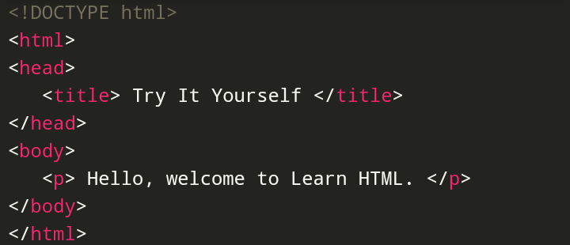

<!DOCTYPE html>
<html>
<head>
   <title> HTML5 INTRODUCTION </title>
</head>
<body>
   <h1 style="text-align: center"> HTML5 Introduction </h1>
   
  

   
 HTML stands Hyper Text Markup Language. It is easy and fun to learn. 

   
 HTML describes the structure for web pages. 

   
 HTML5 is the fifth and current major version of the HTML standard. 

   
   <h2 style="text-align: left"> Why Learn HTML5? </h2>
   
   
 It is essential to learn HTML if you want to build websites and you can't build one if you don't know HTML because it's one of the prerequisites in learning other languages used for web development. 

   
   <h2 style="text-align: left"> Try it Yourself </h2>
   
   
 For you to learn faster and see how our examples would actually look like similarly on a real web browser we have shared the codes here, so what you have to do is just copy the code and paste it in any code editor then run it. Easy peasy!😀 

   
   <h3 style="text-align: left"> Example; </h3>
   
 
  
   

   
   <h3 style="text-align: left"> Output; </h3>
   

   
   

   
  ***
  
   <h2 style="text-align: left"> Example Explained </h2>
   

   
   

   
   ***
   
   <h2 style="text-align: left"> HTML Tags </h2>
   

   HTML Tags are elements names surrounded by angle brackets.In HTML, we start and end with tags. Look at the example below; 
   
   

   
   <h2 style="text-align: left"> Start Tag and End Tag </h2>
   

   
   

   
 Well, that's it😀You have now completed HTML5 Introduction! Pretty easy😄huh? Check on the next topic
   

</body>
</html>